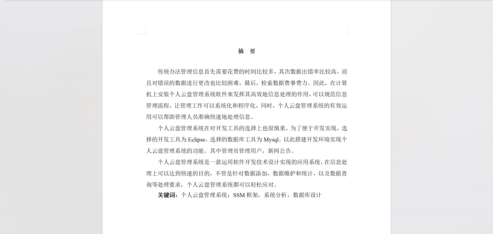
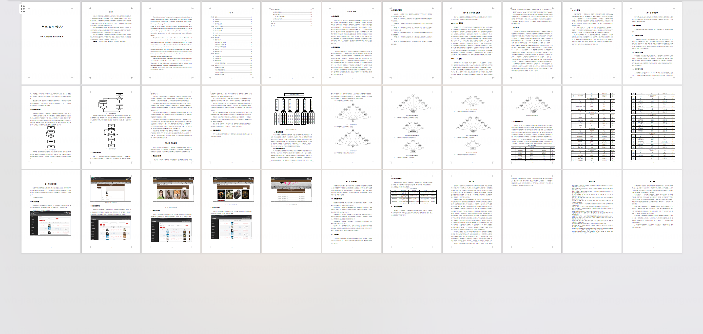
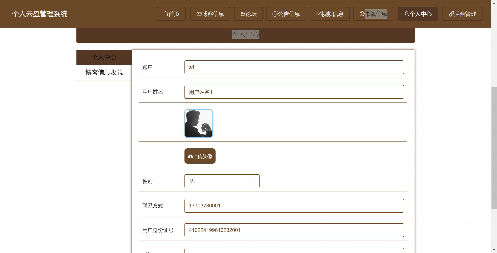
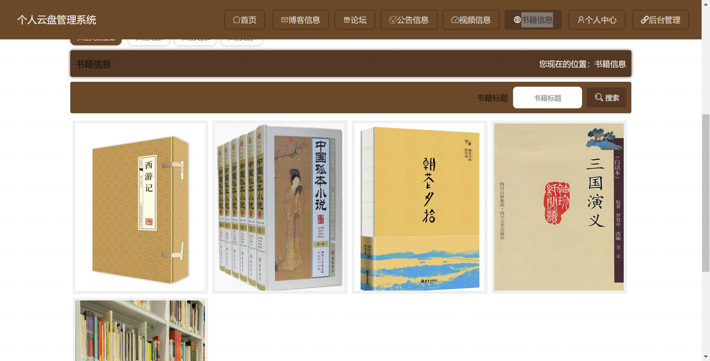
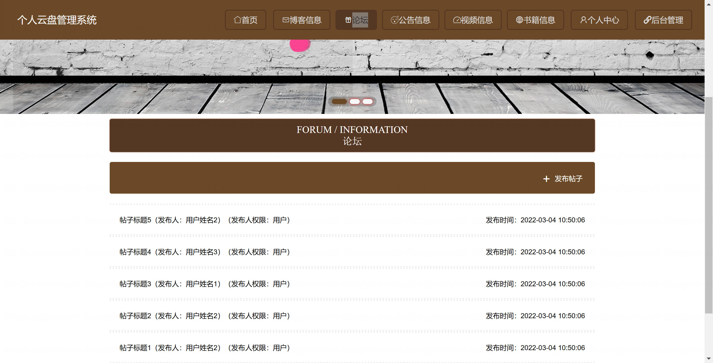
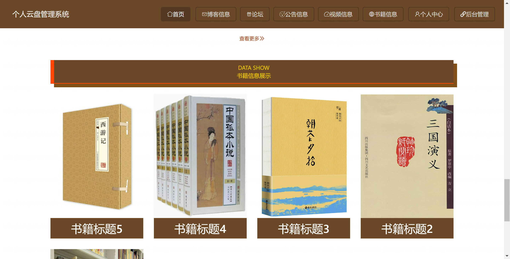
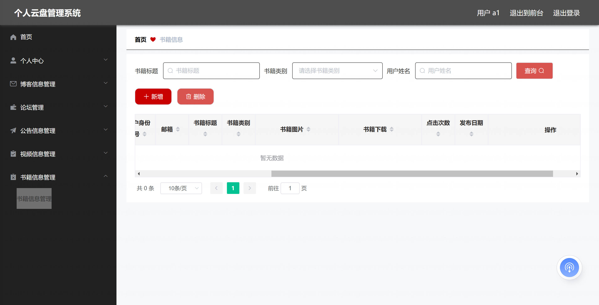
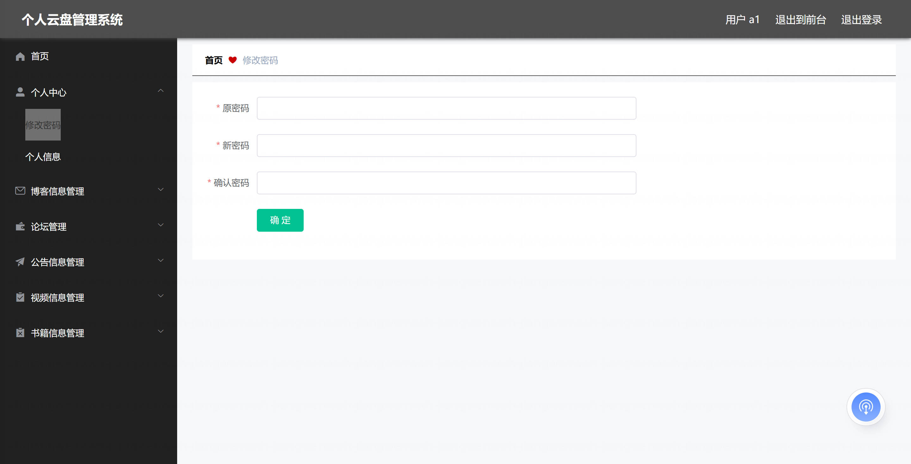

基于Springboot的个人云盘管理系统（程序+论文）
=

### 完整代码获取地址：从戎源码网 ([https://armycodes.com/](https://armycodes.com/))
### 作者微信：19941326836  QQ：952045282 
### 承接计算机毕业设计、Java毕业设计、Python毕业设计、深度学习、机器学习
### 选题+开题报告+任务书+程序定制+安装调试+论文+答辩ppt 一条龙服务
### 所有选题地址https://github.com/nature924/allProject

一、项目介绍
---
基于SpringBoot框架的个人云盘管理系统，系统角色为管理员、用户，主要功能如下

管理员：
基本操作：登录、修改密码、获取个人信息、修改个人信息、退出登录
博客管理：筛选博客、获取博客列表、查看博客详情、新增博客、删除博客、修改博客
博客收藏管理：筛选收藏、获取收藏列表、查看收藏详情、新增收藏、删除收藏、修改收藏
论坛管理：筛选帖子、获取帖子列表、查看帖子详情、发布帖子、删除帖子、修改帖子、设置帖子状态
新闻管理：筛选新闻、获取新闻列表、查看新闻详情、新增新闻、删除新闻、修改新闻
视频管理：筛选视频、获取视频列表、查看视频详情、新增视频、删除视频、修改视频
书籍管理：筛选书籍、获取书籍列表、查看书籍详情、新增书籍、删除书籍、修改书籍
用户管理（前台用户）：筛选用户、获取用户列表、查看用户详情、新增用户、删除用户、修改用户、重置密码
管理员账号管理：筛选管理员、获取管理员列表、查看管理员详情、新增管理员、删除管理员、修改管理员、重置密码

用户：
基本操作：登录、注册、修改密码、获取个人信息、修改个人信息、退出登录
博客管理：获取博客列表、查看博客详情、发布博客、删除博客、修改博客
博客收藏管理：收藏博客、取消收藏、查看收藏列表、查看收藏详情
论坛管理：获取帖子列表、查看帖子详情、发布帖子、删除帖子、修改帖子
新闻浏览：获取新闻列表、查看新闻详情
视频浏览：获取视频列表、查看视频详情
书籍浏览：获取书籍列表、查看书籍详情

二、项目技术
---
- 编程语言：Java
- 数据库：MySQL
- 项目管理工具：Maven
- 前端技术：VUE、HTML、Jquery、Bootstrap
- 后端技术：Spring、SpringMVC、MyBatis

三、运行环境
---
- 操作系统：Windows、macOS都可以
- JDK版本：JDK1.8以上都可以
- 开发工具：IDEA、Ecplise、Myecplise都可以
- 数据库: MySQL5.7以上都可以
- Tomcat：任意版本都可以
- Maven：任意版本都可以

四、运行截图
---
### 论文截图：

### 程序截图：

